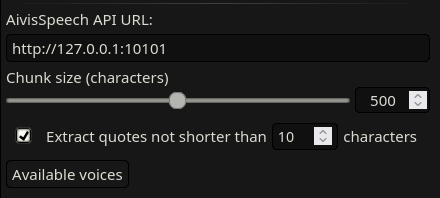
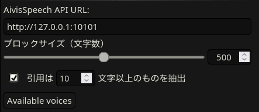

[日本語](#nihongo)

# AivisSpeech Integration for SillyTavern

This SillyTavern extension allows to use the [AivisSpeech][aivis-speech]
Text-to-Speech engine that provides high-quality, expressive Japanese voice
synthesis in a local environment.

Compared to some other TTS engines that are available in SillyTavern out of the
box and are capable of generating Japanese speech, it can produce audio
relatively fast without requiring a high-end graphics card or CPU.

This extension was initally based off the code provided in the [VPN
Taizen][vpn-taizen] article.

## Prerequisites

To use this extension, you need to have an [AivisSpeech][aivis-speech] desktop
application (available on Windows and Mac) or an [AivisSpeech
server][aivis-server] (available on Windows, Mac and Linux and as a Docker
container) installed and running.

To install this extension, use the SillyTavern's built-in extension manager
(**Extensions** > **Manage extensions**).

## Usage and settings

To use AivisSpeech as a TTS engine, go to **Extensions** > **TTS** and select
“AivisSpeech” as a TTS Provider.  If you need, you can customize some settings.

1. **AivisSpeech API URL**

    The base URL for the AivisSpeech HTTP API (if the desktop application or the
    server is running on the current device, this will be
    `http://127.0.0.1:10101` by default).

1. **Chunk size**

    The text is split into chunks before being given to the TTS engine.  The
    splitting is done on possible sentence boundaries (that is, periods,
    question or exclamation marks, etc.), so that the resulting chunks are
    within the specified size *most of the time* (but they are not guaranteed to
    be such).
    
    The recommended value for this setting is 500 characters according to the
    AivisSpeech documentation.

1. **Extract quotes not shorter than _N_ characters**

    If you turn this setting on then quoted phrases that are _N_ characters or
    more will be extracted into separate chunks.  If you set _N=0_ then *every*
    quoted phrase will be extracted.  Only Japanese single corner brackets
    (「these ones」) are examined when searching for quotes.
    
1. **Defer playback until every chunk is processed**

    By default, chunks are played back as soon as they are processed by the
    engine.  If you turn this setting on, the playback will be deferred until
    every chunk of the message is processed.

1. **Preprocessor**

    Enables a WebAssembly preprocessor that runs on each chunk before it is
    sent to AivisSpeech.  This can be used to add custom text normalization,
    including making it easier to synthesize languages other than Japanese or
    English.

    The preprocessor module must be placed in the `preprocessor/`
    folder and should implement the functions defined in
    [`src/preprocessor.ts`][preprocessor]. As a reference implementation, see
    [kotwys/kanajomyton][kanajomyton] (Udmurt language support).

> [!NOTE]
> As per the AivisSpeech documentation, the expression and intonation of voice
> is decided for the whole text fragment given at once.  Depending on the type
> of the conversation you are having and its textual representation, you might
> want to tweak these settings (specifically, to generate more chunks).
>
> Also, applying more “aggressive” chunking strategy allows to reduce the
> response time from the TTS engine in some cases (while one voice fragment is
> playing, the next one can be generated in the background).  Yet, there is also
> a chance that you will hear large pauses between chunks if your machine is
> unable to generate audio as fast as needed.

# SillyTavern 用 AivisSpeech 連携拡張

この SillyTavern 拡張機能を使って、ローカル環境で高品質かつ感情豊かな日本語音声
を生成する [AivisSpeech][aivis-speech] 音声合成エンジンを利用できます。

SillyTavern に標準で含まれる他の日本語対応音声合成エンジンと比べると、高性能な GPU
や CPU を必要とせず、比較的高速に音声を生成できます。

この拡張は、もともと[VPN大全][vpn-taizen]の記事で紹介されているコードをベース
に作成されています。

## 前提条件

この拡張を利用するには、[AivisSpeech][aivis-speech] デスクトップアプリ
（Windows / Mac 向け）または [AivisSpeech サーバー][aivis-server]  
（Windows / Mac / Linux、または Docker コンテナ対応）をインストールして実行して
おく必要があります。

拡張のインストールは、SillyTavern の組み込み拡張マネージャーから行います
(**拡張機能** > **拡張機能を管理**)。

## 使い方と設定

AivisSpeech を音声合成エンジンとして使うには、**拡張機能** > **TTS** を開き、TTS
Provider として「AivisSpeech」を選択してください。必要に応じて設定を変更できます。

1. **AivisSpeech API URL**

    AivisSpeech の HTTP API の基底 URL です。（デスクトップアプリやサーバーが現
    在の端末で動作している場合、デフォルトは `http://127.0.0.1:10101` です）

1. **ブロックサイズ**

    音声合成エンジンに渡す前にテキストをブロックに分割します。分割は文の区切り
    （句点、疑問符、感嘆符など）によって行われ、ほとんどの場合は指定したサイズ内
    に収まりますが、必ずしも保証されるわけではありません。

    AivisSpeech のドキュメントによれば、この設定値は**500文字**をお勧めします。

1. **引用は _N_ 文字以上のものを抽出**

    この設定を有効にすると、引用符で囲まれた文のうち _N_ 文字以上のものを別のブ
    ロックとして抽出します。_N=0_ に設定した場合、すべての引用文が抽出されます。
    引用符の検出には日本語のかぎかっこ（「〜」）のみが使用されます。

1. **全てのブロックが処理されるまで再生を遅延**

    デフォルトでは、ブロックはエンジンによって処理され次第、すぐに再生されます。
    この設定を有効にすると、メッセージの全てのブロックが処理されるまで再生が延
    期されます。

1. **前処理**

    ブロックごとに WebAssembly の前処理を実行してから AivisSpeech に渡します。
    カスタムなテキスト正規化を追加できるので、日本語や英語以外の言語で音声合成
    しやすくする用途にも使えます。

    前処理モジュールは `preprocessor/` フォルダーに配置し、
    [`src/preprocessor.ts`][preprocessor] に定義されている関数を実装する
    必要があります。インターフェースに沿った実装例として、
    [kotwys/kanajomyton][kanajomyton] （ウドムルト語対応）も参考になります。

> [!NOTE]
> AivisSpeech のドキュメントによれば、音声の表情や抑揚は一度に渡された文章全体に
> 基づいて決定されます。会話の種類やテキストの形式によっては、設定を調整し（特に
> ブロック数を増やすことで）より自然な出力が得らる場合があります。
>
> また、分割戦略をより「積極的」に行うことで、音声合成エンジンの応答時間を短縮で
> きます。（ある音声ブロックを再生中に、次のブロックをバックグラウンドで生成でき
> るため）。しかし、ご利用のマシンが必要な速度で音声を作成できない場合、ブロック
> の間に大きなポーズが挟まれる可能性があります。

こちらは日本語が母語ではないので、もしこのドキュメントや UI に言語の問題がありま
したら、ぜひご指摘ください。

[aivis-speech]: https://aivis-project.com/
[aivis-server]: https://github.com/Aivis-Project/AivisSpeech-Engine
[vpn-taizen]: https://vpn-taizen.com/how_to_use_aivisspeech_sillytavern/
[preprocessor]: ./src/preprocessor.ts
[kanajomyton]: https://github.com/kotwys/kanajomyton
